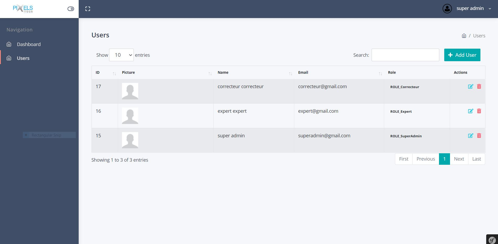
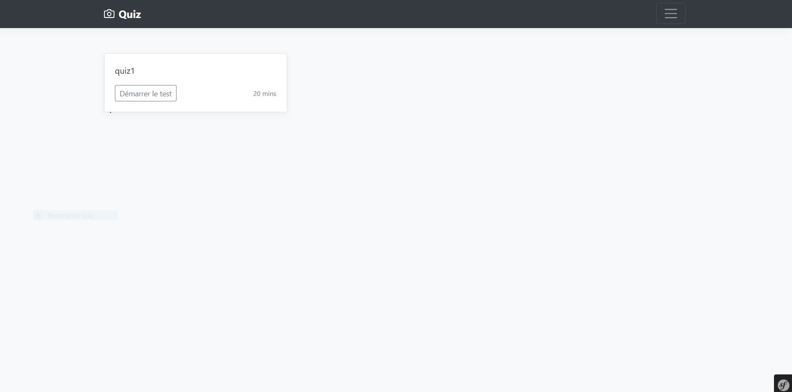

Installation
------------

**Installer les differents composents via composer**

composer install

**creer la base de données**

 php bin/console doctrine:database:create

 php bin/console doctrine:shema:update --force
 
 **alimenter la base de données**
 php bin/console doctrine:fixtures:load
 

**Lancer l'application**

 php -S localhost:8000 -t public -d display_errors=
 
 http://localhost:8000/
 
 link backend: http://localhost:8000/admin/home
 
  -login: superadmin@gmail.com
  
  -password: 1234
  
Link demo Front: https://www.olive-craft.com/pixels/public/

Backend: https://www.olive-craft.com/pixels/public/admin/home

 

 
 
 
  
 

 
 
